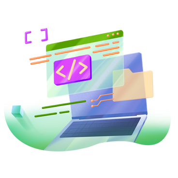

<!-- 
Thank you for using this README template! I hope it helps you create a clear and informative README for your project.

Consider giving it a star ⭐️ if it was useful!
-->

<!-- A starting point for the "back to top" -->

<!-- Replace this logo with your own -->

  
   

  <h3><b>Mastering Exercism Tracks</b></h3>

 

<!-- About The Project -->
## About The Project
This repository serves as a central hub for my solutions to Exercism's track challenges, encompassing a wide range of programming languages such as `C`, `Python`, `Go`, `Java` and beyond. Each solution provides an in-depth look into my problem-solving approach, offering not only a comprehensive record of my progress but also insights into my growth as a programmer across diverse language ecosystems.

<!-- Add tech stacks you used for the proejct -->
### Technologies
* [![][c-logo]][c-url]
* [![][python-logo]][python-url]

 

<!-- Getting Started -->
## Getting Started

### Requirements

- Python 3.6+

### Installation & Usage
See each directory for installation and usage instructions specific to each programming language.

<!-- ### Installation
Outline the steps required to install and set up the project environment. -->

<!-- example -->
<!-- 1. Clone the repository
2. Install backend dependencies: `pip install -r requirements.txt`
3. Install frontend dependencies: `npm install`
4. Start the server: `python manage.py runserver` -->

<!-- Usage -->
<!-- ## Usage
Describe how to use the project once it's set up.  
Provide examples such as code snippets and screenshots. -->

 

<!-- Roadmap -->
## Roadmap
Work in progress 🚧 🚀

- [ ] C
- [ ] Python 
- [ ] Go
- [ ] Java

 

<!-- License -->
## License
Licensed under the MIT License - see the LICENSE file for details.

<!-- Back to top -->

(<a href="#readme-top">back to top</a>)

<!-- Stack Logos and Links -->
[c-logo]: https://img.shields.io/badge/c-%2300599C.svg?style=for-the-badge&logo=c&logoColor=white
[c-url]: https://en.wikipedia.org/wiki/C_(programming_language)
[python-logo]: https://img.shields.io/badge/python-3670A0?style=for-the-badge&logo=python&logoColor=ffdd54
[python-url]: https://www.python.org/

<!-- 
Reference
Icons8 - logo image
shields.io - stack logos
-->
